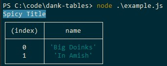

# Dank Tables

Dank Tables is a javascript library for printing tables with coloured titles



## Usage

```javascript
const dankTable = require('dank-tables')

dankTable('Spicy Title', data, 'blue')
```

## Valid Colours

**All colors currently need to be in lowercase because I'm too lazy to check for case sensitivity**

- black
- red
- green
- yellow
- blue
- magenta
- cyan
- white
- crimson

## Contributing
Pull requests are welcome. For major changes, please open an issue first to discuss what you would like to change.

## License
[MIT](https://choosealicense.com/licenses/mit/)

## Buy me a coffee
<a href="https://www.buymeacoffee.com/fuelwaster" target="_blank"></a>
