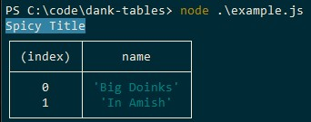

# Danker Logs

Danker logs is a javascript library for printing logs with coloured titles



## Usage

```javascript
const dankLogs = require('./');

dankLogs.dankTable('Spicy Title', [{name: 'Big Doinks'}, {name: 'In Amish'}], 'cyan');

dankLogs.dankLog('Spicy Title 2', 'Big Doinks in Amish', 'cyan');
```

## Valid Colours

- black
- red
- green
- yellow
- blue
- magenta
- cyan
- white
- crimson

## Contributing
Pull requests are welcome. For major changes, please open an issue first to discuss what you would like to change.

## FAQ
- **Why "Danker Logs"**
    - Because "Dank Logs" was taken

## License
[MIT](https://choosealicense.com/licenses/mit/)

## Buy me a coffee
<a href="https://www.buymeacoffee.com/fuelwaster" target="_blank"></a>
